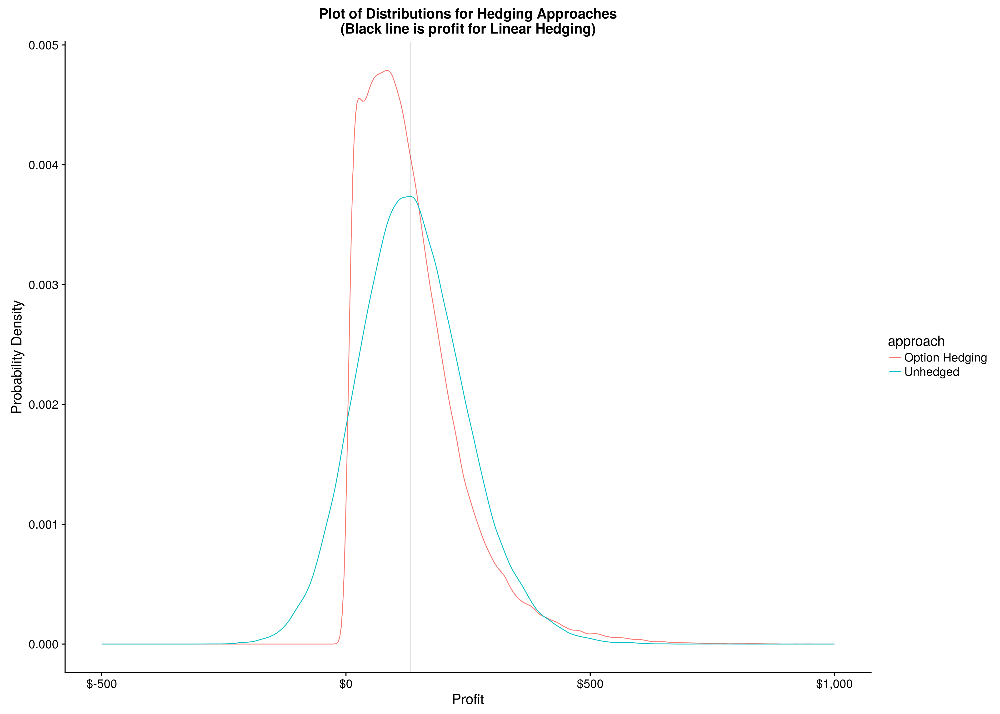
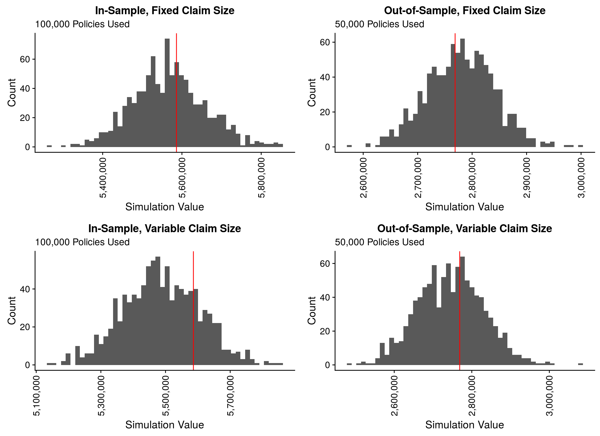

```{r knit_opts, include=FALSE, warning=FALSE, message=FALSE}
rm(list = ls()); gc()

knitr::opts_chunk$set(tidy  = FALSE
                     ,cache = FALSE
                     ,fig.height =  8
                     ,fig.width  = 11)

library(tidyverse)
library(scales)
library(cowplot)
library(gRain)


options(width = 80L
       ,warn  = 1
        )

set.seed(42)
```

# Sample of Previous Work

---

#### Option Trading

```{r calculating_fund_navs, echo=FALSE}
fundnav_tbl <- read_csv('data/fundnav_values.csv', col_types = cols()) %>%
    filter(fundlabel %in% c('BUYHOLD','TAIL10', 'COVERCALL','PROTECTPUT'))

ggplot(fundnav_tbl) +
    geom_line(aes(x = date, y = nav, colour = fundlabel)) +
    scale_y_continuous(labels = comma) +
    xlab("Date") +
    ylab("Net Asset Value") +
    ggtitle("Net Asset Values for Hedging Strategies")
```

---

#### Quant Finance



---

#### Probabilistic Graphical Models

```{r pgm_underwriting_fraud, echo=FALSE}
hn <- cptable(~HN
             ,values = c(0.01, 0.99)
             ,levels = c("Dishonest", "Honest"))

ts <- cptable(~TS
             ,values = c(0.60, 0.20, 0.20)
             ,levels = c("Nonsmoker", "Quitter", "Smoker"))

tb <- cptable(~TB
             ,values = c(0.75, 0.20, 0.05)
             ,levels = c("None", "Overweight", "Obese"))

th <- cptable(~TH
             ,values = c(0.95, 0.05)
             ,levels = c("None", "HeartDisease"))


ds <- cptable(~DS | HN + TS
             ,values = c(1.00, 0.00, 0.00  # (HN = D, TS = N)
                        ,1.00, 0.00, 0.00  # (HN = H, TS = N)
                        ,0.50, 0.40, 0.10  # (HN = D, TS = Q)
                        ,0.05, 0.80, 0.15  # (HN = H, TS = Q)
                        ,0.30, 0.40, 0.30  # (HN = D, TS = S)
                        ,0.00, 0.10, 0.90  # (HN = H, TS = S)
                         )
             ,levels = c("Nonsmoker", "Quitter", "Smoker"))

db <- cptable(~DB | HN + TB
             ,values = c(0.95, 0.05, 0.00  # (HN = D, TB = NM)
                        ,0.90, 0.10, 0.00  # (HN = H, TB = NM)
                        ,0.30, 0.70, 0.30  # (HN = D, TB = OW)
                        ,0.10, 0.80, 0.10  # (HN = H, TB = OW)
                        ,0.00, 0.10, 0.90  # (HN = D, TB = OB)
                        ,0.00, 0.10, 0.90  # (HN = H, TB = OB)
                         )
             ,levels = c("Normal", "Overweight", "Obese"))

dh <- cptable(~DH | HN + TH
             ,values = c(0.90, 0.10        # (HN = D, TH = N)
                        ,0.90, 0.10        # (HN = H, TH = N)
                        ,0.50, 0.50        # (HN = D, TH = H)
                        ,0.10, 0.90        # (HN = H, TH = H)
                         )
             ,levels = c("None", "HeartDisease"))


ss <- cptable(~SS | TS + DS
              ,values = c(0.05, 0.95        # (TS = N, DS = N)
                         ,0.35, 0.65        # (TS = Q, DS = N)
                         ,0.95, 0.05        # (TS = S, DS = N)
                         ,0.01, 0.99        # (TS = N, DS = Q)
                         ,0.10, 0.90        # (TS = Q, DS = Q)
                         ,0.40, 0.60        # (TS = S, DS = Q)
                         ,0.01, 0.99        # (TS = N, DS = S)
                         ,0.05, 0.95        # (TS = Q, DS = S)
                         ,0.10, 0.90        # (TS = S, DS = S)
                          )
              ,levels = c("Serious", "NotSerious"))

sb <- cptable(~SB | TB + DB
              ,values = c(0.01, 0.99        # (TB = NM, DB = NM)
                         ,0.30, 0.70        # (TB = OW, DB = NM)
                         ,0.50, 0.50        # (TB = OB, DB = NM)
                         ,0.01, 0.99        # (TB = NM, DB = OW)
                         ,0.05, 0.95        # (TB = OW, DB = OW)
                         ,0.30, 0.70        # (TB = OB, DB = OW)
                         ,0.01, 0.99        # (TB = NM, DB = OB)
                         ,0.05, 0.95        # (TB = OW, DB = OB)
                         ,0.10, 0.90        # (TB = OB, DB = OB)
                          )
              ,levels = c("Serious", "NotSerious"))

sh <- cptable(~SH | TH + DH
              ,values = c(0.01, 0.99        # (TH = N, DH = N)
                         ,0.60, 0.40        # (TH = H, DH = N)
                         ,0.20, 0.80        # (TH = N, DH = H)
                         ,0.10, 0.90        # (TH = H, DH = H)
                          )
              ,levels = c("Serious", "NotSerious"))


m  <- cptable(~ M | SS + SB + SH
              ,values = c(0.99, 0.01        # (SS = S, SB = S, SH = S)
                         ,0.90, 0.10        # (SS = N, SB = S, SH = S)
                         ,0.95, 0.05        # (SS = S, SB = N, SH = S)
                         ,0.85, 0.15        # (SS = N, SB = N, SH = S)
                         ,0.85, 0.15        # (SS = S, SB = S, SH = N)
                         ,0.60, 0.40        # (SS = N, SB = S, SH = N)
                         ,0.60, 0.40        # (SS = S, SB = N, SH = N)
                         ,0.10, 0.90        # (SS = N, SB = N, SH = N)
                          )
              ,levels = c("Medical", "NoMedical"))


underwriting_grain <- grain(compileCPT(list(hn
                                           ,ts, tb, th
                                           ,ds, db, dh
                                           ,ss, sb, sh
                                           ,m)))

plot(underwriting_grain)
```

---

#### Lapse Modelling

```{r show_lapse_modelling, echo=FALSE}
lapse_curves_tbl <- read_csv('data/lapse_curves.csv', col_types = cols()) %>%
    mutate(year = month / 12) %>%
    filter(year <= 10)


ggplot(lapse_curves_tbl) +
    geom_line(aes(x = year, y = cuml_prob, colour = policy_id)) +
    expand_limits(y = 0) +
    xlab("Time in Force (years)") +
    ylab("Cumulative Survival Probability") +
    ggtitle("Cumulative Survival Probability for Lapse Modelling")

```

---

#### Insurance Pricing Assessment



---

### Opportunities


\


